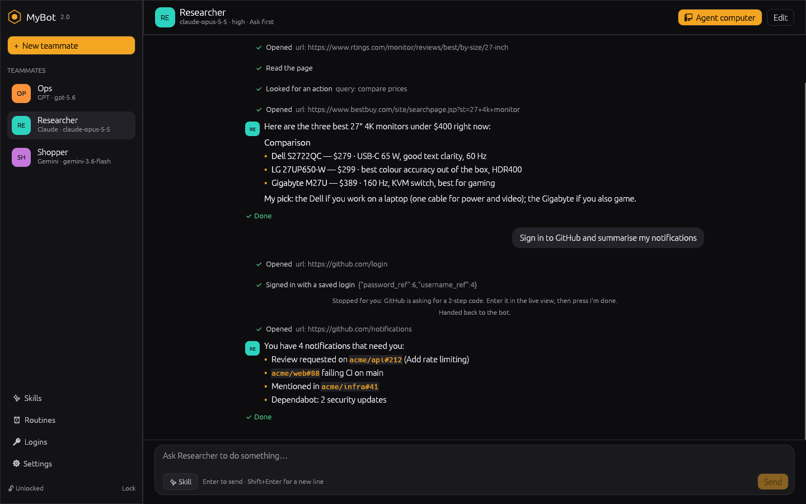
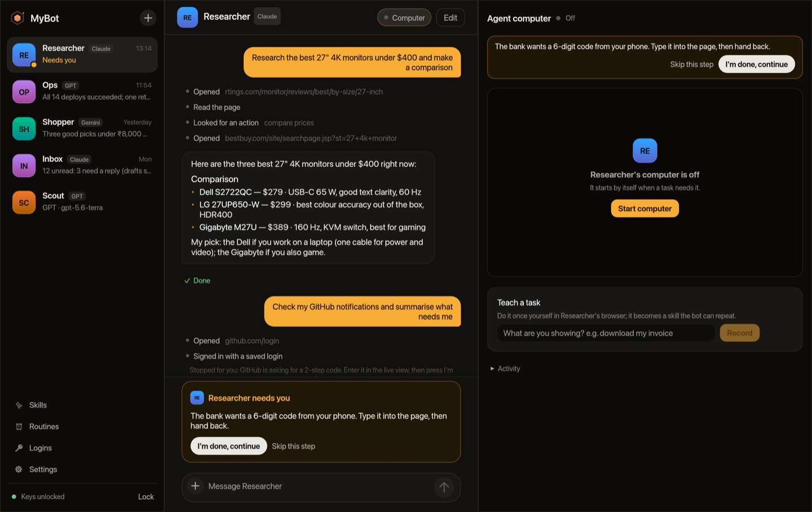
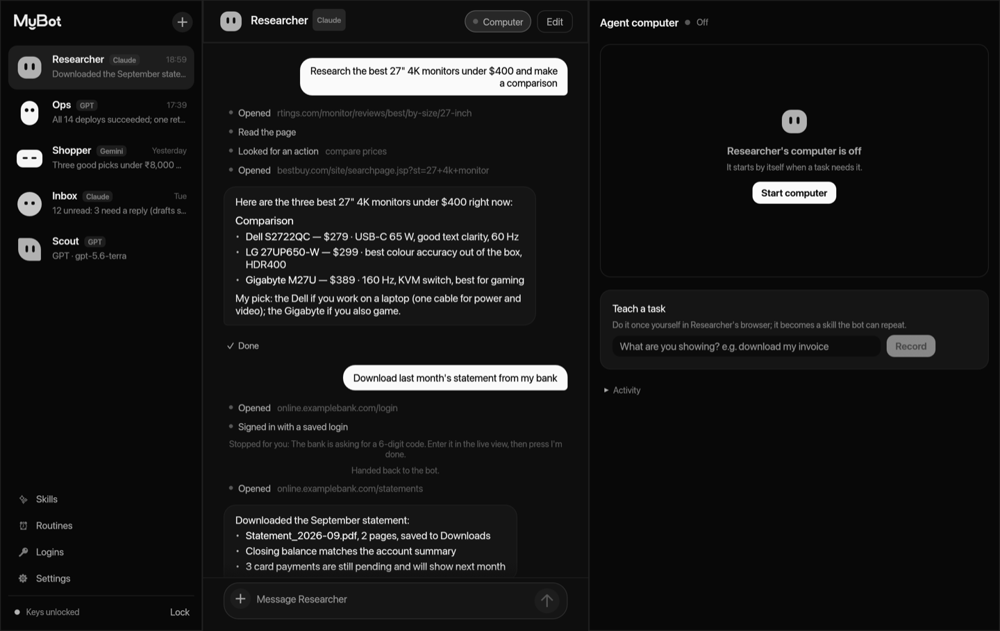
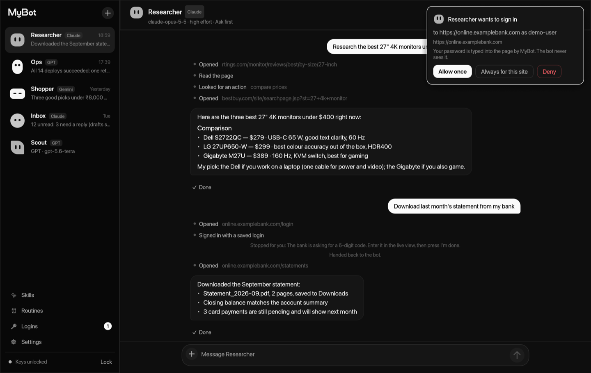
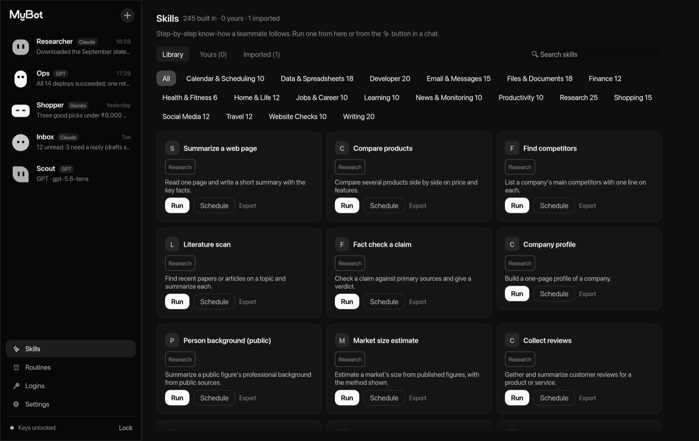
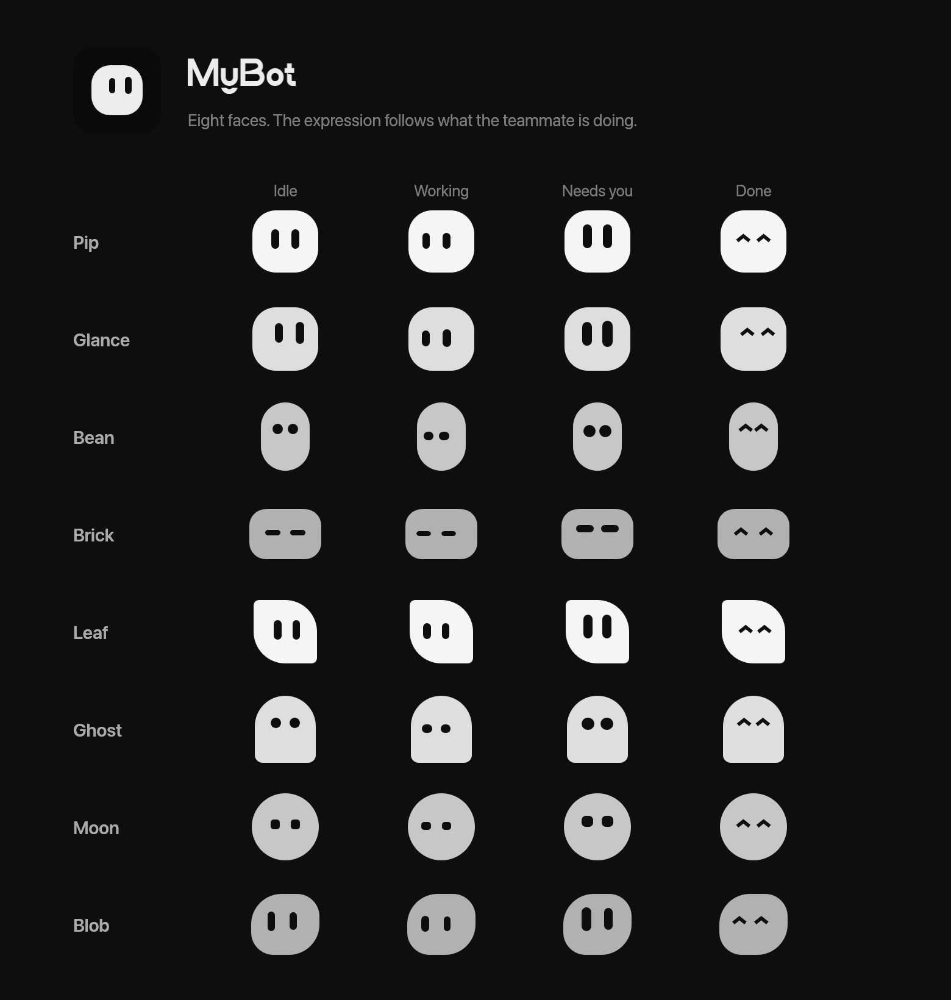
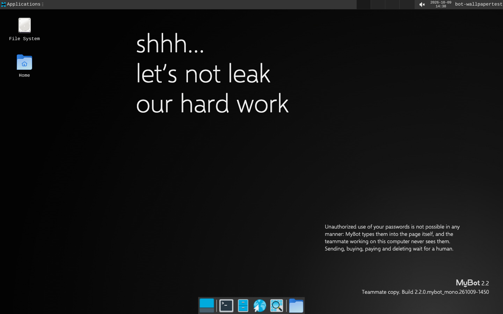

# MyBot 2.0

AI teammates that work on their own computers, in a native desktop app written in
Rust. There is no web view anywhere: the window, the live view of each bot's
desktop and the takeover controls are all drawn by the app itself (egui).

You talk to a teammate on the left, read what it does in the middle, and watch
its computer on the right. When it hits a CAPTCHA, a 2-step code, a card form or
anything it should not do alone, it stops and asks you. It never sees your
passwords: when it needs to sign in, you get a request, and MyBot types the
saved password into the page itself.

Bring your own key for Claude, GPT or Gemini.



| What | How many | Reference |
|---|---|---|
| Actions a teammate can take | 249 in 13 categories | [docs/ACTIONS.md](docs/ACTIONS.md) |
| Built-in skills | 245 in 18 categories | [docs/SKILLS.md](docs/SKILLS.md) |
| Sites with a known sign-in page | 300 | [docs/SITES.md](docs/SITES.md) |
| App features | listed one by one | [docs/FEATURES.md](docs/FEATURES.md) |

Skills in the Agent Skills format (`SKILL.md`, the format Claude uses) import
and export, so third-party skills work too.

---

## Download

**[mybot2.web.app](https://mybot2.web.app/)** —
builds for Windows, macOS (Apple silicon and Intel) and Linux, also on the
[releases page](https://github.com/mohith2309real/mybot/releases). The release
notes say how to open them the first time, since they aren't signed by Apple or
Microsoft yet. You also need Docker for the agent computers.

Once installed, MyBot keeps itself up to date: it downloads new releases in the
background, checks their signature, and asks you to **Restart**. See
[It updates itself](#it-updates-itself).

## Build from source

You need Rust 1.88 or newer.

```sh
cd mybot2
cargo build --release -p mybot-app
./target/release/mybot2            # opens the app
./target/release/mybot2 --help     # the command line
```

On Linux the window needs X11 or Wayland libraries; on Debian/Ubuntu:
`sudo apt install libxkbcommon-x11-0 libgl1 libegl1`. The app has been tried by
hand on Linux. Windows and macOS builds come from the release workflow
(`.github/workflows/release.yml`), which builds and smoke-tests each one; push a
`v*` tag to run it.

### First run

1. Choose a passphrase. It encrypts your API keys and saved logins on this
   computer. You can let the system keychain remember it.
2. Settings → AI providers: paste a key. A key in `ANTHROPIC_API_KEY`,
   `OPENAI_API_KEY` or `GEMINI_API_KEY` works too, and wins. For GPT you can
   instead choose **Sign in with ChatGPT** and run on your ChatGPT plan (it
   starts the open-source `openai-oauth` helper, which needs Node.js; the first
   time, your browser opens to sign in).
3. **+ New teammate**: give it a name, a model, how much effort to spend, and
   when it should ask you first.
4. Ask it to do something.

---

## The window

| | |
|---|---|
|  |  |
| **When it needs you.** The step waits in the conversation and inside its computer: hand back with *I'm done, continue*, or *Skip this step*. For confirmations, *Approve* or *Decline*. | **The agent computer.** Its desktop, live. *Take over* gives you its mouse and keyboard. *Teach a task* records you doing something once. |
|  |  |
| **A sign-in request.** Allow once, always for this site, or deny. Silence counts as no. | **Skills.** 245 built in, your own, ones you taught, and imported Agent Skills. |
|  |  |
| **Faces.** Every teammate is one of eight faces (pick one when you create or edit it). The face shows what it's doing: reading, typing, thinking or scanning while it works; wide-eyed when it needs you; ^ ^ when it's done. The app icon is the face *Glance*. | **Its desktop.** Each teammate's computer starts on the MyBot wallpaper, with a dark panel. |

More screenshots: [imported skills](docs/screenshots/imported.png),
[routines](docs/screenshots/routines.png), [saved logins](docs/screenshots/logins.png),
[settings](docs/screenshots/settings.png), [new teammate](docs/screenshots/new-teammate.png).

---

## How it works

### It updates itself

Every release carries `latest.json` (the version, and each download's URL, size
and SHA-256) and `latest.json.sig`, an Ed25519 signature made by the release
workflow. MyBot checks a few seconds after it opens and every six hours:

1. It fetches both files and checks the signature against the public key built
   into the app (`crates/app/src/update.rs`). Anything not signed by MyBot's
   release key is ignored.
2. If the release is newer, it downloads this computer's build and checks its
   size and SHA-256 against the signed manifest.
3. It unpacks it and shows **MyBot x.y.z is ready · Restart**. Restarting swaps
   the app in place (the old one is kept under `~/.mybot/updates/previous`) and
   reopens it.

An old manifest replayed later can't downgrade you: only a strictly newer
version is ever installed. Turn automatic updates off in Settings → About;
`mybot2 update` (or `--check`) does the same from a terminal. Development builds
run from `target/` never replace themselves.

### Each teammate gets its own computer

Each conversation gets a Docker container. Inside it, each teammate gets its own
desktop (its own X display), its own Chromium and its own browser profile.
The container starts by itself the first time a task needs it. The first
start builds the image, which takes a few minutes.

The live view is a VNC client written in Rust and drawn as a texture in the
window. It is not noVNC in a web view. It handles the RFB 3.3/3.7/3.8 protocols,
VNC passwords, and the Raw, CopyRect and DesktopSize encodings. In takeover
mode, the mouse, scroll wheel, keyboard (including Ctrl shortcuts) and paste
from your clipboard go to the bot's desktop. *Open in browser* shows the same
desktop in a browser tab if you want it bigger.

### It asks before things that matter

Every teammate has a mode:

- **Ask first** (the default): it stops before anything consequential your
  request didn't ask for: sending, posting, buying, paying, deleting, changing
  access, deploying or accepting terms. It also checks in when it's unsure a
  step is wanted. If your request already said to do it ("…and send it to
  Sam"), it doesn't ask again. Negations like "don't send it" are understood.
- **Auto**: it gets on with routine steps without checking in. Consequential
  steps your request didn't ask for still wait for you.
- **Bypass**: it doesn't stop for consequential steps either.

In every mode:

- CAPTCHAs, 2-step codes, card fields and checkout buttons make it stop for
  you, as do any `always-confirm` rules in the skill it is running.
- Destructive shell commands are refused outright.
- A paused task waits 15 minutes for you, then stops cleanly.

### Saved logins: it signs in, but never sees the password

- Passwords live in `~/.mybot/logins.enc`, encrypted with AES-256-GCM and a
  key derived with scrypt.
- When a teammate wants to sign in, it asks with `fill_login`. You get a card:
  allow once, always for this site, or deny. If nobody answers, the request
  expires, and that counts as no.
- MyBot types the password into the page itself, over the browser's DevTools
  protocol. The password never appears in anything sent to the model. Page
  reads blank out password field values.
- A login is bound to the exact origin it was saved for, over https only
  (http is allowed for localhost).
- At the moment of filling, MyBot checks the live page again: the page is still
  on that origin, the password box is a real password field, and the username
  box is a text, email or tel field.
- A sign-in that takes two steps gets a 5-minute allowance for that task, so
  you aren't asked twice for one sign-in.
- The history of requests keeps who asked, for which site, and what you
  decided. It never keeps passwords.
- The files are the same ones MyBot 1.x uses, byte for byte, so both versions
  share keys and logins.

### Skills

- **Built in.** 245 step-by-step skills, in categories from Research to Travel.
  Some ask for inputs. Many carry `always-confirm` rules: places where the bot
  must stop and ask you, every time.
- **Yours.** Write one in the app, or teach one (below).
- **Imported.** Use any skill in the Agent Skills format (a folder with a
  `SKILL.md`, optionally with scripts, references and assets). You can bring
  it in as a folder, a `.zip`, or a GitHub folder link, or drop it on the
  window.
  - MyBot scans every file first, for things like code fetched and run, access
    to credentials, and prompt-injection phrasing.
  - An imported skill starts switched off. You turn it on after reading the
    review.
  - If its files change after you've reviewed them, MyBot refuses to turn it on.
  - Its scripts run only inside the bot's computer, never on yours.
- **Export.** Any skill can be written out as a `SKILL.md` folder: built in,
  yours, or imported.

### Teach a task

In the agent computer, name what you're about to show, press **Record**, and do
the task once in the bot's browser. Then:

1. MyBot records clicks, typing, selections, form submits and page changes.
   Keyboard keys are recorded by name (Enter, Tab, Escape) only, so
   keystrokes can't rebuild a password.
2. Passwords, one-time codes, card numbers, long numbers and token-like values
   are blanked inside the page before they reach MyBot.
3. MyBot checks every recorded action a second time, including credentials
   hiding in URLs.
4. When you stop, or after 10 minutes, the teammate's model drafts a skill
   from the log. You edit it and save it.

### Routines

A routine runs a skill on a schedule (cron, with presets like "weekdays at 9"),
optionally with inputs. Routines fire while the app is open, or while
`mybot2 routines watch` runs.

### Models

| Provider | API | Notes |
|---|---|---|
| Claude (default `claude-opus-5-5`) | Messages, streaming | Adaptive thinking with summaries. Effort from low to max. Server-side fallback where the model supports it. Tool input streamed and checked as strict JSON. Refusals handled. A tool call cut off by the length limit is never run. |
| OpenAI | Responses, streaming | |
| Gemini | `streamGenerateContent` | Thought signatures are sent back unchanged. |

Model lists are fetched live in the new-teammate dialog. Each provider can
point at a custom endpoint. A local OpenAI-compatible proxy on localhost works
without a key.

---

## Command line

Everything in the window is also a command:

```text
mybot2 keys set|list|rm                      API keys (asked for without echo)
mybot2 bots list|add|rm                      teammates
mybot2 run <bot> "<what to do>" [--skill S --arg k=v]
                                             stream a task; answer sign-ins and pauses in the terminal
mybot2 tasks | log <id> | resume <id> | cancel <id>
mybot2 logins add|list|rm|always|pending|allow|deny|history
mybot2 skills list|show|import|review|enable|disable|rm|export
mybot2 teach <bot> "<what you'll show>"      record in the bot's browser, draft and save a skill
mybot2 routines list|add|rm|on|off|run|watch
mybot2 actions [query] [--json]              search the 249 actions
mybot2 sites [query] [--json]                search the 300 sites
mybot2 models <provider>                     live model list
mybot2 computer status|reset-profiles|down
```

Secrets (`keys set`, `logins add`, the passphrase) are read without echo from a
terminal, or as one line from stdin when piped.

### Environment

| Variable | Meaning |
|---|---|
| `MYBOT_HOME` | Data folder (default `~/.mybot`, shared with 1.x) |
| `MYBOT2_DB` | Database file (default `$MYBOT_HOME/mybot2.db`) |
| `MYBOT_PASSPHRASE` | Unlock without asking |
| `ANTHROPIC_API_KEY`, `OPENAI_API_KEY`, `GEMINI_API_KEY` | Provider keys |

---

## Code

```text
crates/core      providers (Claude, OpenAI, Gemini), the agent loop, policy, approvals,
                 human handoff, cron, SQLite storage
crates/vault     encrypted keys and logins (compatible with 1.x), system keychain
crates/computer  Docker computers, DevTools browser driving, boundaries, login fill,
                 the VNC client
crates/actions   the 249 actions, the toolbox teammates use, imported-skill store,
                 teach-a-task recorder
crates/catalog   the 245 built-in skills, the 300 sites, Agent Skills parsing and scanning
crates/app       the desktop app (egui) and the `mybot2` command line
```

### Tests

```sh
cargo test --workspace
```

The suite covers:

- **Providers.** Each provider's wire format, against local stub servers.
- **The agent loop.** Pauses, approvals and cancellation.
- **Vault compatibility.** Files from MyBot 1.x open in 2.0, and the reverse.
- **Real browser.** Against headless Chromium: the login fill, the
  password-leak check, boundaries, tabs, and the teach-a-task recorder,
  checking that a typed password never reaches the recording. These tests skip
  themselves if Chromium isn't installed.
- **Every local action** runs its example.
- **The catalog.** Every built-in skill exports as a valid `SKILL.md`.
- **The thread view.** How run events become the conversation.

The app itself was also driven end to end under a virtual display: typing a
task, the reply streaming in, the pause banner, *I'm done*, and the finished
task, with a stand-in for the Claude API.

### Not done yet, or not tried

- **The computer in Docker.** The containers, the live view against a real
  desktop, and teach-a-task through the window weren't exercised end to end
  here, because the build machine has no Docker. The VNC client is tested
  against a scripted VNC server, and the recorder is tested against real
  Chromium.
- **Teach-a-task covers one tab.** It records the tab that was open when
  recording started. Tabs opened during the demonstration aren't recorded.
- **macOS and Windows** are built and smoke-tested by the release workflow,
  but nobody has used the app on them by hand yet.
